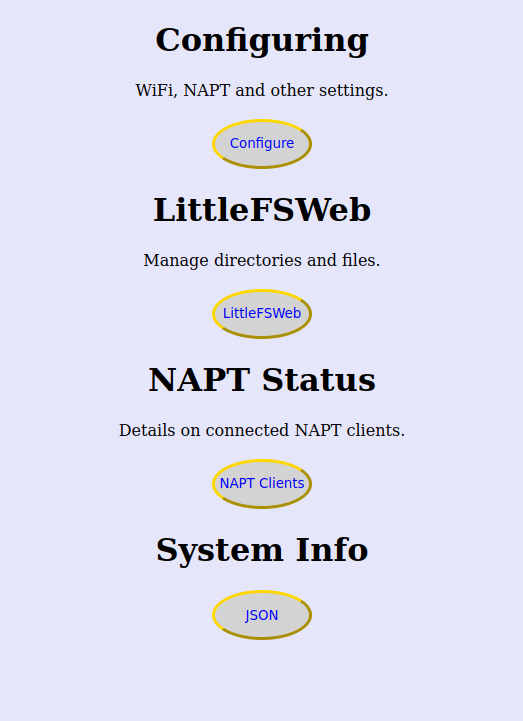
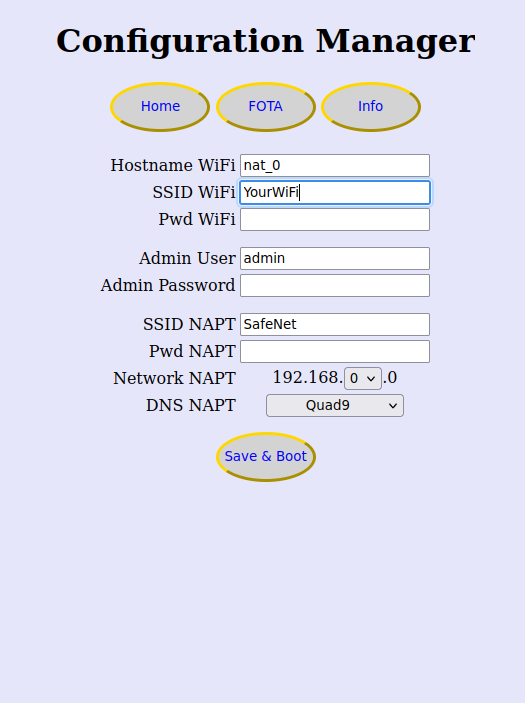
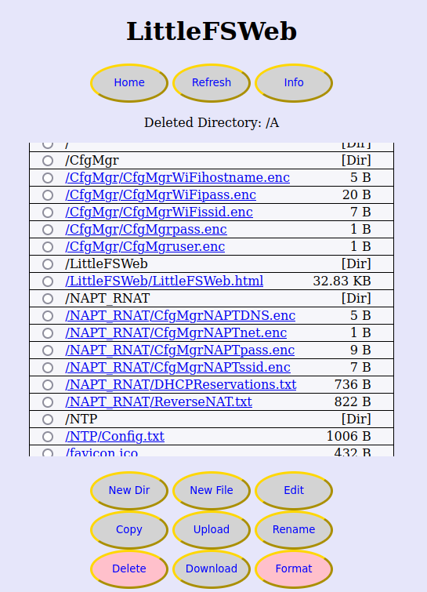

# ESP8266 Servers App

You could leave this app as is and use is as a WiFi extender or 'MQTT-like' server in your network but you can also extend it because it does not use that much memory.

ESP8266-Servers has servers like:

  - LittleFS Web (upload, download, copy, rename, create, edit etc.)
  - Router with NAPT and Reverse NAT
  - WebSockets server with example clients (GPIO and DataStore like MQTT)
  - and a Configuration Manager

Before the details and since there are many license types out there (kindly meant).... 

  - As long as you keep this notice with this app you are 
      licensed to do anything legal you want to do with it

## Setup and functions

Every now and then you may want to have a look at the screenshots at the end of this page

  First use the green 'Code' button on https://github.com/JackV2020/ESP8266-Server to download the zip file 

  Extract that zip folder in your Arduino IDE Sketchbook folder and name the folder ESP8266-Server

  - It is modular, every server part has its own tab(s) in Arduino IDE
    - Makes it is easy to copy and use parts in other apps
    - Every tab has more detailed info in its header
      - what is it for and how to get it running
      - which libraries does it use and how to get these
      - etc.
    - ESP8266-Servers.ino integrates the parts into one ready to use app

  - Configuration Manager to manage setting
    - The initial installation has no settings but provides an access point
      - WiFi SSID 'Setup 192.168.4.1 1234567890'
      - Use your laptop/phone/tablet/... to connect to to this WiFi SSID
      - Logon with password 1234567890 and browse to 192.168.4.1
    - On the home page you click Configure
    - Click the Info button and read what's there (click again to hide)
    - Fill in the fields you want to change
      - Make sure that the 'Network NAPT' does not match your home WiFi
    - Fill in the password in the bottom field (initial 'secret')
    - Click 'Save' and wait for the count down to finish
    - Use your laptop/phone/tablet to find the new SSID
    - The new WiFi SSID contains:
      - the SSID name you gave in
      - and the hostname and the IP it has on your home WiFi
    - Now you can
      - connect to your home WiFi and browse to that IP address
        - OR
      - connect to the new WiFi SSID, logon and
        - browse to 192.168.'Network NAPT'.1 like 192.168.7.1

  - LittleFSWeb to manage the LittleFS file system on a web page
    - Access your device via your home WiFi or the NAPT network
    - On the home page you click LittleFSWeb
    - Logon (initial 'admin' 'admin', maybe you changed it already)
    - Click the Info button and read what's there
      - Create new files and (subdirectories)
      - Select a folder and upload files
      - Download files
      - Rename and delete a file or directory(tree)
      - Edit files in web based editor
      - and more

  - NAPT_RNAT implements a simple router
    - NAPT for 4 clients
    - DHCP reservations template file which can be editted with LittleFSWeb
    - Web page showing IP, MAC and name of connected NAPT clients
    - Reverse NAT to access clients from 'outside'
    - Reverse NAT template file which can be editted with LittleFSWeb
    
  - Websocket server with 2 applications
    - html and .ino websocket client examples are available in LittleFSWeb
    - Control 6 GPIOs, react on interrupts of 5 GPIO's and receive A0 reading
    - wsDataStore to share data between clients in a sort of 'MQTT-like-way'
      - you can share data between clients on NAPT and WiFi side without RNAT
      - the app itself can also share in wsDataStore (see NTP client)

  - NTP client:
    - The internal clock is synchronised with ntp
    - Has functions to give you boottime, uptime and current time in your app
    - puts 'BootTime' in wsDataStore for demo purpose 

  - OTA, 'Over The Air' allows you to upload sketches remotely
    - No need to connect to your computer when you have an upgrade

  - Examples and templates
    - Some files are created after startup but only when they do not exist
    - When you wreck one, delete it, reboot and the default is recreated
    - Template for ntp configuration (Summer and winter time)
    - Template for DHCP reservations on NAPT subnet
    - Template for Reverse NAT
    - /zExamples folder with 3 websocket client examples
      - html to share data with other clients (already shows BootTime)
      - ino to share data with other clients (also with html clients)
      - html to control GPIOs, react on interrupt and receive A0 readings
      - and proc_processor.html.proc for the proc_processor (see below)
    - /index.html is also a template you can edit and delete
    - /LittleFSWeb/LittleFSWeb.html is the LittleFSWeb page you may change
      - be carefull with this one
      - when you wreck it use http://'YourESP8266DeviceIP'/LittleFSWebFixIt

  - The main webserver
    - Has a function in it so it can replace strings
        in your html, css and js files with other strings
      - See the proc_processor.html.proc example in /zExamples for that
      - Note the extra file extension .proc to trigger the replacing
    - Also serves a json page with information you may be interested in like
      heap info, network and time details
    - Prefers to serve gzip files so it soes not have to send that much
      - Try the next :
        - Upload LittleFSWeb.html.gz to /LittleFSWeb (from LittleFSWeb_html_gz) 
      - OR if you made changes to /LittleFSWeb/LittleFSWeb.html
        - Download /LittleFSWeb/LittleFSWeb.html
        - On your computer gzip (with for example 'gzip -k LittleFSWeb.html')
        - Select the folder /LittleFSWeb
        - Upload '/LittleFSWeb/LittleFSWeb.html.gz'
      - AND
        - Edit /LittleFSWeb/LittleFSWeb.html, clear it and save it
        - Now you have more space and LittleFSWeb page may start faster

  NOTES:

  - I use Wemos D1 mini Pro and suppose this works on other ESP8266 devices

  - To use the memory efficiently the wsDataStore is in 2nd Heap 
    and MMU setting needs to be option 3 to enable wsDataStore:
    - "16KB cache + 48KB IRAM and 2nd Heap (shared)" 
    - this also gives you more code memory

  - You may tune:
    - SERIAL_PRINT
      in ESP8266-Servers.ino to enable/disable printing to Serial
    - DEFAULT_MAX_WS_CLIENTS
      in ESP8266-Servers.ino to change the number of web socket clients
    - chunkSize
      in LittleFSWeb.h where the file is saved in chunks to allow parallel activities
    - IP_NAPT_VALUE and IP_PORTMAP_VALUE
      in NAPT_RNAT.ino control the table sizes and are very memory consuming
    - wsDSNumRows in wsServer.ino to set the number of entries in the wsDataStore

  - You can use the web server for other things like
    - Create a folder /games
    - Upload all files in the project subfolder games to this new /games folder
    - Close all your browser windows
    - Start a browser to http://'YourESP8266DeviceIP'/games/index.html
    - Note that you can play the games without the need to logon to LittleFSWeb

  - Did you lock yourself out in a terrible way ?
    - Connect D8 to the 3.3V while it runs which 
      - deletes files with Configuration Manager password and LittleFSWeb credentials
      - deletes /index.html and LittleFSWeb.html
      - deletes /index.gz and LittleFSWeb.gz
      - reboots
      - and you have default access again
      - all other files are still in place

## Screenshots

The first is the home page with access to other pages.
 The Configuration Manager to enter settings. 
 The main screen of LittleFSWeb.
 Note the Info buttons which explain more.

<table border = 1 bordercolor ="red" align = center>
<tr>
<td></td>
<td></td>
<td></td>
</tr>
</table>

The editor window with resize buttons for the font. 
Resize the text area on your computer using the little triangle in the bottom right corner and use 2 fingers on your mobile mobile. 
In the text area you can use ctrl-s to save and tab to enter 2 spaces.
 The NAPT overview with my phone as client. (2nd row in DHCPReservations.txt so address 101)
 The json page. You find that the napt_IP 192.168.0.1 has the 0 from the Configuration Manager page.
 You also find the my phone as NAPT client and my laptop 192.168.2.27 running 2 websocket clients.
 I just rebooted so the uptime is just 43 seconds.
 

<table border = 1 bordercolor ="red" align = center>
<tr>
<td></td>
<td></td>
<td></td>
</tr>
</table>

Two screenshots of the html websocket clients
 You can start more than 1 instance of each and see they are in sync.
 As soon as you add a value in the datastore it is there in the other window.
 You can also use the ino example for the datastore which prints info on the console.

<table border = 1 bordercolor ="red" align = center>
<tr>
<td></td>
<td></td>
</tr>
</table>

 
 

### Thanks for reading and enjoy using (parts of) this